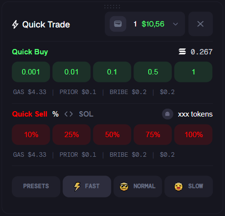

# Interactive Widget Dashboard

This project is a solution for a take-home assignment to build a dynamic, interactive widget interface. The application allows users to manage multiple widgets that can be dragged, resized, docked to the sides of the screen, and persisted across sessions. A key feature is the inclusion of a custom-designed, non-dockable "Quick Trade" widget.

### Custom Widget


## ✨ Core Features

*   **Dynamic Layout**: Add, remove, and toggle the visibility of widgets.
*   **Draggable & Resizable**: Floating widgets can be freely moved and resized within the viewport.
*   **Docking System**: Drag a widget to the far left or right edge of the main content area to "dock" it into a sidebar.
*   **Undocking**: Click and drag a docked widget back into the main area to turn it back into a floating widget.
*   **Custom Non-Dockable Widget**: A special "Quick Trade" widget that has a unique UI and is configured to only ever be a floating widget.
*   **State Persistence**: The position, size, and status of all widgets are saved to the browser's Local Storage, so the layout is preserved after a page refresh.
*   **Layout Reset**: A "Reset Layout" button in the header restores all widgets to their initial default state.

## 🛠️ Tech Stack

*   **Framework**: Next.js (React)
*   **State Management**: Zustand
*   **Styling**: Tailwind CSS
*   **Icons**: React Icons + Custom SVGs

## 🚀 Getting Started

Follow these instructions to get a copy of the project up and running on your local machine.

### Prerequisites

*   Node.js (v18.x or later)
*   npm, yarn, or pnpm

### Installation & Setup

1.  **Clone the repository:**
    ```bash
    git clone https://github.com/dz-mykolas/trade-widgets
    cd trade-widgets
    ```

2.  **Install dependencies:**
    ```bash
    npm install
    # or
    yarn install
    ```

3.  **Run the development server:**
    ```bash
    npm run dev
    # or
    yarn dev
    ```

4.  Open [http://localhost:3000](http://localhost:3000) in your browser to see the application.

## 📂 Project Structure & Code Highlights

The codebase is organized to separate concerns between state management, components, and page layout.

```
src
├── app
│   └── page.js             # Main entry point, orchestrates the layout and widget rendering.
├── components
│   ├── Layout              # Contains structural components (Header, Sidebar, Footer, etc.).
│   └── Widgets
│       ├── DockedWidget.js     # Wrapper for a widget when it is in a docked state.
│       ├── FloatingWidget.js   # Wrapper for a floating widget, using react-rnd for drag/resize.
│       ├── Widget.js           # The generic, reusable frame for all widgets.
│       └── QuickTradeContent.js # The custom UI for the non-dockable widget.
└── hooks
    ├── useWidgetStore.js   # The heart of the application: Zustand store for all widget state.
    └── useHasHydrated.js   # A utility hook to prevent server/client hydration mismatches.
```
